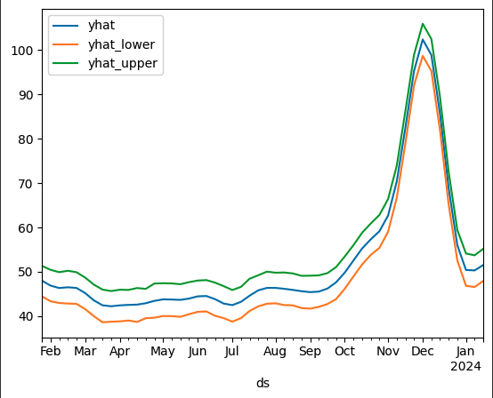
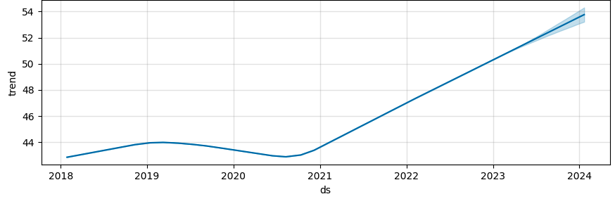
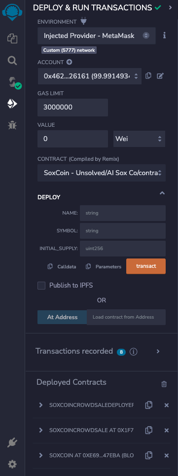
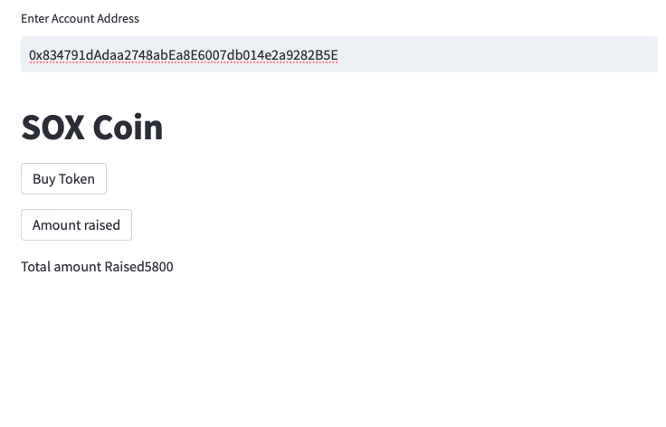
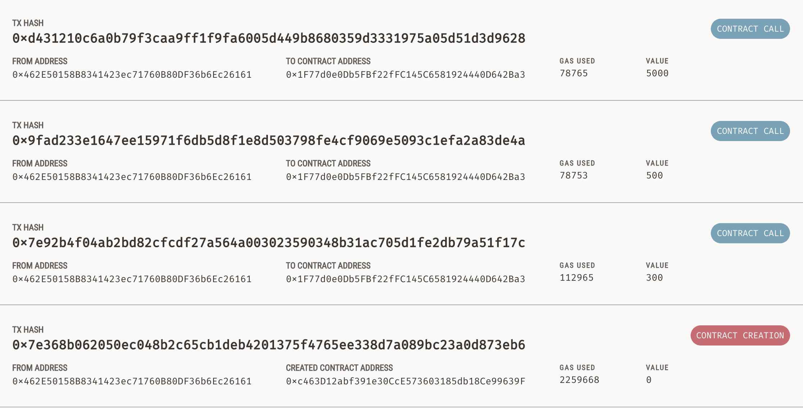
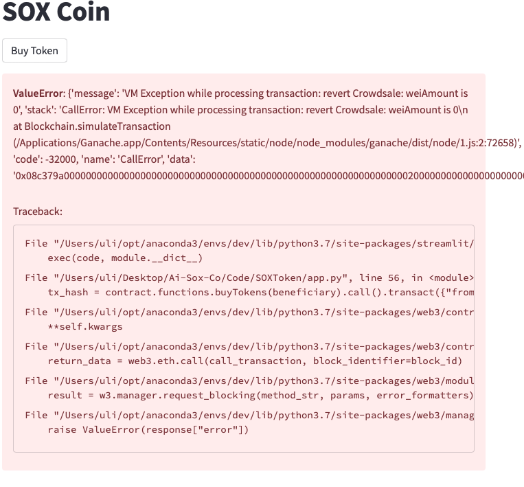

# Start Up E-commerce Business Analysis 

Questions to answer:

* When are people searching for socks the most?

* Determine seasonality trends for 2023

* When would be the ideal Launch date for google adds marketing campaign 

------------------------------------------------

This Project will provide a Business Analysis for start up e-commerce store named AI Sox Co.

Ai Sox Co intended audience are sock enthusiast. As a new online store, Ai Sox Co plans to launch a google add campaign to attract new visitors to the site. 

To avoid a bad launch and Maximize marking opportunities , we will be using ML to forecast google search trends for “socks”and identify seasonality patters that can be in the companies best interest. 

We will mine the search traffic data for predictable seasonal patterns of interest in the company using historical data. Using FaceBook Phrophet Model, we'll predict future trends using Google Trends Data and provide a market analysis to determin the best markeingn opportunity. 

---------------------

### Data: 

We need Google Search Traffic for the search term “Socks” 
This can be obtained from google trends by searching the past 5 years if search traffic result.

Further search results could be obtained. 

### Data Cleanup & Exploration:

* Converted CSV File into Pandas DataFrame 
* Renamed Columns to Identify our Target and Set the Date column as index
* Originally anticipated Daily search traffic results, the data contained weekly average search traffic for the previous 5 years.
* Understanding that Daily Search traffic could be quite large, the prediction could still be done using weekly.
* The Socks: USA Column represent the search traffic popularity from 0-100. The search traffic never goes bellow 39. 

Already, with the search traffic for socks never going bellow 39 in 5 years, we’re looking at a consistent demand for socks .

### Data Analysis :

What we determined based on historical data:

A seasonality trend can be visualized . Prior to 09/2021 ( pre pandemic) , sock search results tend to trends the most in September through December and slows down January through August . 

We did not anticipate for a sudden change in search trend patters after 09/2021. This may be to Covid 19 pandemic in the united stated which resulted in a lot of people shopping online for a variety of products . 

* After reviewing the data frame ,we reset the index and renamed the columns DS & Y format. 

* Then we fit the data to our model. We created a new DataFrame to store a 52 week prediction  and assigned it to a new variable 

After creating a Prophet model to predict Google Search Traffic for the term “Socks”for 2023 , the historic data trends were also reflected in the predictions with strong seasonality trends in holiday season ( September -December) and slow seasonal search traffic from January - August. 

Using the Plot-components function, We can see a positive trend in sock search results over the last 5 years and can anticipate increase popularity in socks for the remainder of 2023, specifically in the holiday season. 

* To capitalize on sock search traffic, Ai Sox Co should launch their google add marketing campaign during Holliday of 2023 in efforts to attract new customer to its site.

* Over all, we were able to answer the questions needed to avoid a failed launch and identified seasonality patterns for marketing opportunities.

------------------------------------
# ICO

 In order to attract new investors, we will be launching a ICO. Using Blockchain Technology,we will launch a Crowsale Smart Contract that allows users to send ether in exchange for the companies crypto currency, SoxCoin.

We will demo this on a local block chain and a streamlit UI.

## Crowdsale contract

* First, we create our token contract by inheriting the ERC-20, ERC-20Detailed and ERC-20Mintable  libraries.

* Create the CrowdSale contact which inherits from our SoxCoin contract, Crowdsale and MintedCrowdsale libraries 

* In the SoxCoinCrowdsale contract , we will include another contract named SoxCoinCrowdsaleDeployer.

* The Deployer will create the crowdsale address and the token address.

* Deploy the crowdsale contract at address generated from the deployer. 

* This contract will be responsible for minting new tokens and providing the total amount raised from the crowdfunding campaign .

### Smart Contracts Deployed and injected meta mask.

* Our original intentions were to create a decentralized application that allowed Ai sox Co customer to Buy tokens directly from the UI . 

* However , some complication arose resulting in only the amount raised function being callable. 

Local Block Chain Ganache Test

Errors:

* The biggest challenge was in creating the Stream lit app . Since we inherited from Crowdsale , the “amount” perimeter was set to msg.sender which did not allow us to call weiAmount in stream lit.  

* Given more time, we could have created a new crowdsale contact to inherit from with the buyTokens function adjusted to show weiAmount as a public

------------------------------------------------------------------------------------------------------------
### Resources: 

https://trends.google.com/trends/explore?date=today%205-y&geo=US&q=socks&hl=en

aisoxco.io
